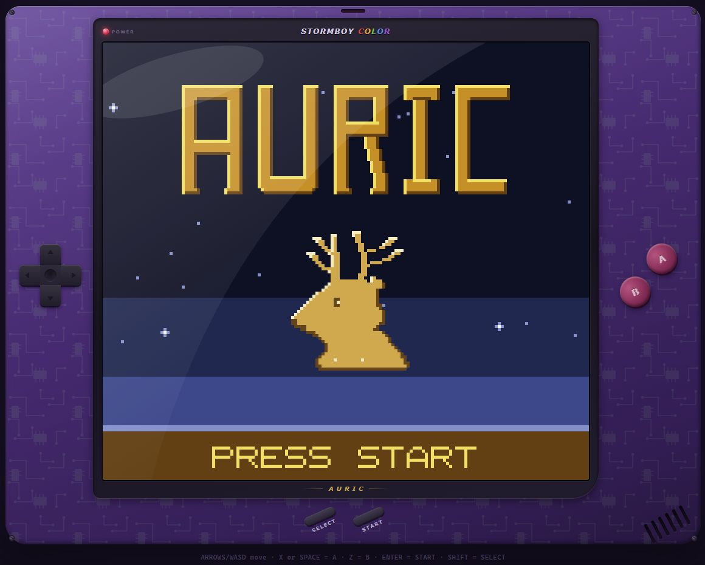
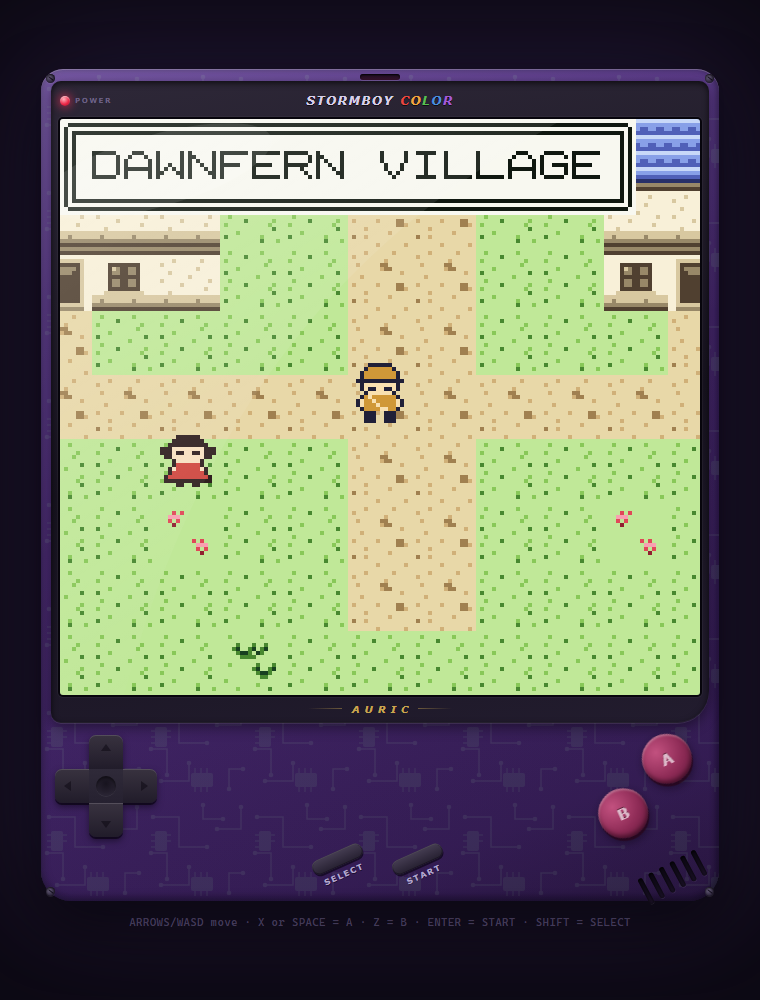
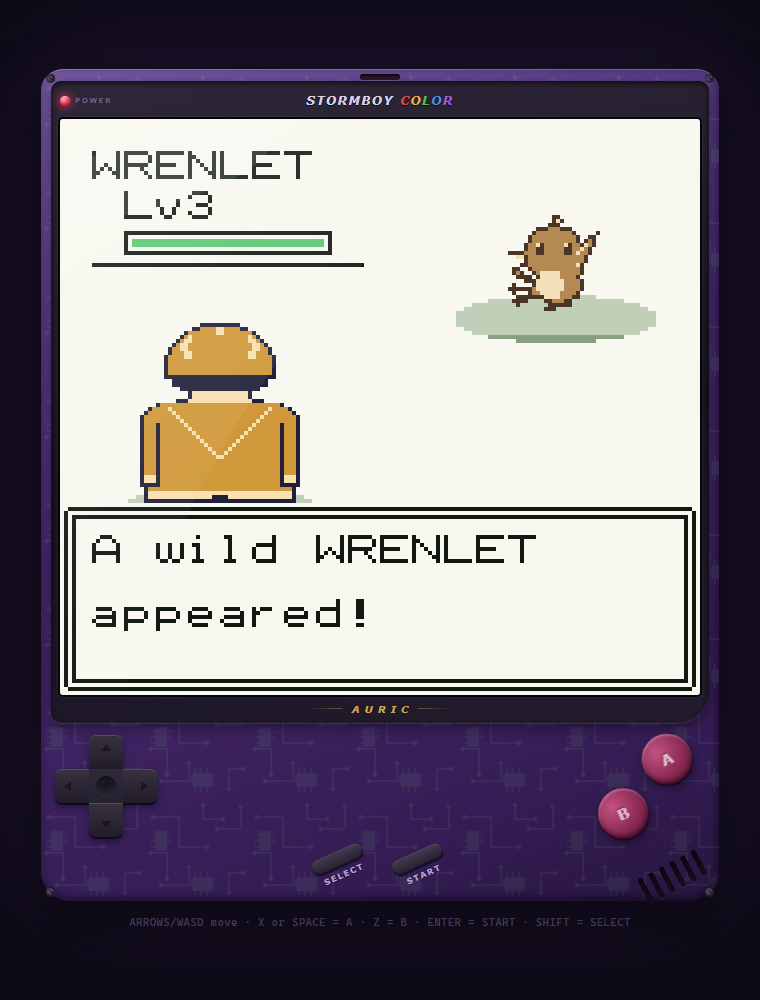

# AURIC

**An Ambervale Story** — a small monster-taming adventure built in TypeScript, with a 160 × 144 software framebuffer, pixel-grid art and synthesized music.

Explore Ambervale, choose a companion, catch wild Kindra and earn the first badge. The world changes with the local clock: different creatures appear after dark, towns change palette, and weekly events give familiar places another reason to visit.

**[Play the prototype in your browser](https://stormburpee.github.io/auric-game/)** · No account or installation required.

<p>
  
  
  
</p>

## Play locally

Use **Node.js 22.16 or newer** and npm. No accounts, API keys, backend or database are required.

```sh
npm ci --ignore-scripts
npm run dev
```

Open the local URL printed by Vite. Press **Enter** or the on-screen **START** button, then choose **NEW GAME**. Audio starts after the first button press.

| Action | Keyboard | Touch |
|---|---|---|
| Move / choose | Arrow keys or WASD | D-pad |
| Confirm / interact | X or Space | A |
| Cancel / back | Z or Backspace | B |
| Start / pause menu | Enter | START |
| Select | Shift | SELECT |
| Preview time of day | F1 | — |
| Preview day of week | F2 | — |

F1 and F2 cycle through overrides and then return to the real local clock. Save through **START → SAVE**. There is one save slot per browser/site, stored in localStorage; clearing site data removes it. Saves are not synced between devices, and future prototype versions may change the save format.

## What is implemented

- An opening adventure from Dawnfern Village to the first Wind Warden, with dialogue, trainers, a rival, indoor areas and a nighttime location.
- 24 Kindra species and 46 moves, turn-based combat, capture, evolution, held items and party/storage management.
- A journal, map and phone through the story-unlocked Charm Gear; fishing, nursery/egg mechanics and weekly events.
- Day/night palette changes, time-dependent encounters, generated pixel art and a four-channel Web Audio soundtrack.
- Keyboard and multi-touch controls that share the same virtual input layer.

**Status:** playable prototype, one badge. This is a compact game and engineering sample, not a finished full-length RPG. Automated checks cover mechanics, data, strings, map contracts, artwork, music and interface logic. They do not substitute for playing through every story branch or testing every browser and touch device. The title screenshot shows this release; the exploration and battle screenshots show an earlier build of the opening areas.

## Engineering

The game has **no third-party runtime dependencies**. Vite, TypeScript and Vitest are development tools.

```text
src/engine/        framebuffer, input, fixed ticks, coroutines, audio and saves
src/game/          rules, creatures, maps, dialogue, scenes and interface
src/shell/         responsive handheld shell and touch controls
tests/             mechanics and content regression tests
docs/              mechanics, world, story, art and audio specifications
```

The engine is separate from the game vocabulary. Maps compile from ASCII layouts; sprites decode from readable pixel grids; cutscenes use generators; a seeded RNG makes mechanics reproducible in tests. Palette transforms provide day and night without duplicating the artwork.

```sh
npm test                 # run all tests once
npm run typecheck        # strict TypeScript checks
npm run build            # typecheck and produce dist/
npm run preview          # inspect the production build locally
```

`dist/` is a static site and uses relative asset paths. Deploy only that build directory to a static host. The source includes a development-only debug interface; Vite removes it from the production build. No telemetry or remote content requests are implemented by the game.

An optional GitHub Pages workflow is included. After enabling **GitHub Actions** as the Pages source in the repository settings, manually run **Deploy demo to GitHub Pages**. It tests, checks types and builds before deploying only `dist/`. Ordinary pushes do not deploy the demo.

## Contributing

Bug reports with reproduction steps are welcome. Include the browser, map or battle, expected result, and what happened. For mechanics or content changes, add a regression test and update the relevant specification. Keep changes focused; the current priority is reliability and completing the existing adventure.

## License and provenance

The original code, game text, pixel-grid artwork and synthesized score are released under the [MIT License](LICENSE). Art and music are defined in source; the game does not bundle ripped sprites, ROM data, recordings or commercial game assets. See [PROVENANCE.md](PROVENANCE.md) for the release boundary and [THIRD_PARTY.md](THIRD_PARTY.md) for development-tool attribution.
